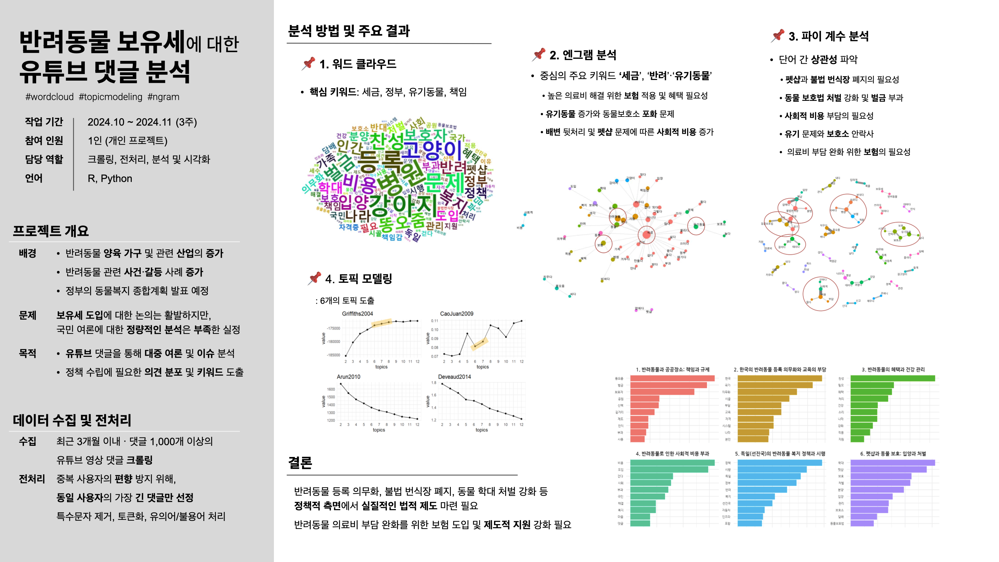

# 반려동물 보유세에 관한 유튜브 댓글 여론 분석
진행 기간: 2024년 10월 ~ 2024년 11월 

[PPT 발표자료](https://github.com/Doonco/TopicModeling/blob/main/%EB%B0%98%EB%A0%A4%EB%8F%99%EB%AC%BC%EB%B3%B4%EC%9C%A0%EC%84%B8.pdf)
## 1. 주제 선정 배경

반려동물 가구와 관련 산업의 증가로 반려동물 보유세 도입 논의가 필요해졌습니다. 
또한, 반려동물 관련 사건사고가 증가하고 있어, 정부는 **동물복지 종합계획**을 발표했지만 여론조사는 이루어지지 않았습니다. 
이에 대한 다양한 의견을 파악하고자 **유튜브 댓글**을 분석하여 여론을 파악했습니다.

## 2. 데이터 수집 및 전처리

- **유튜브 댓글 크롤링**: 댓글이 1,000개 이상인 최근 3개월 이내 영상 선택
- **전처리 과정**: 
  - 동일 사용자별로 가장 긴 댓글만 선택하여 데이터 불균형 방지
  - 불필요한 문자 제거, 토큰화 후 유의어와 불용어 처리

## 3. 분석 방법 및 결과

### 3.1 워드 클라우드
- **주요 논의**: 
  - 재정적 측면
  - 정부의 역할
  - 찬성 의견 및 필요성
  - 사회적 책임

### 3.2 엔그램 분석
- **주요 키워드**: "세금", "반려동물", "유기동물"
- **연관 동사**: 의료비 해결을 위한 보험 적용, 유기동물 문제, 배변 문제 등

### 3.3 파이계수 분석
- 단어 간 상관 분석을 통해 **주요 키워드들**의 관계 도출

### 3.4 토픽 모델링
- **도출된 주제**: 
  - 반려동물과 공공장소: 책임과 규제
  - 한국의 반려동물 등록 의무화와 교육의 부담
  - 반려동물의 혜택과 건강 관리
  - 반려동물로 인한 사회적 비용 부과
  - 독일(선진국)의 반려동물 복지 정책과 시행
  - 펫샵과 동물 보호: 입양과 처벌
## 4. 해석 및 결론

- **정책적 필요성**: 
  - 법적 제도 마련과 정책적 지원 강화가 필요함
  - **반려동물 의료비 부담 완화**를 위한 **보험 도입 및 제도적 지원 강화**

## 5. 사용 언어 및 분석 도구 
- **언어** : R
- **분석 도구 및 패키지** : 'tidyverse', 'tm', 'topicmodels', 'ggplot2', 'wordcloud2', 'KoNLP' 등

